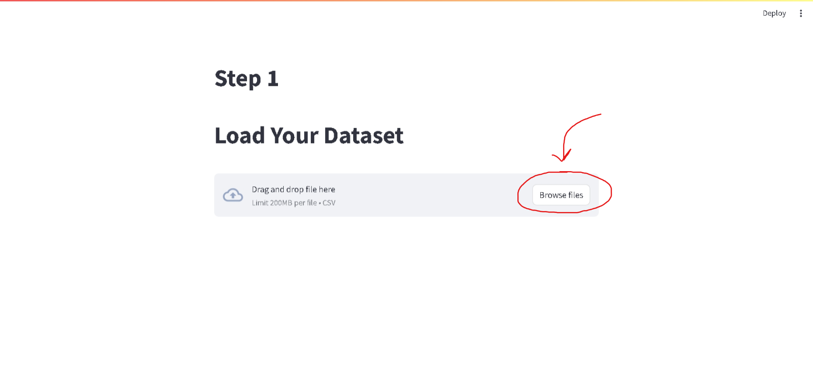
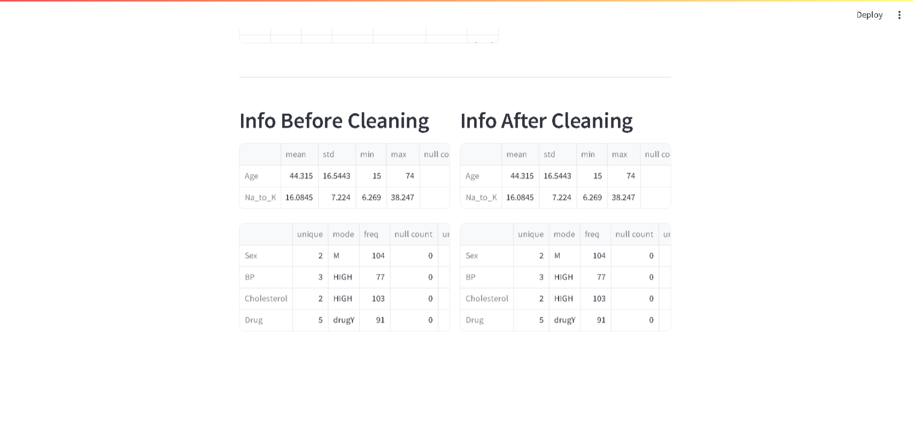
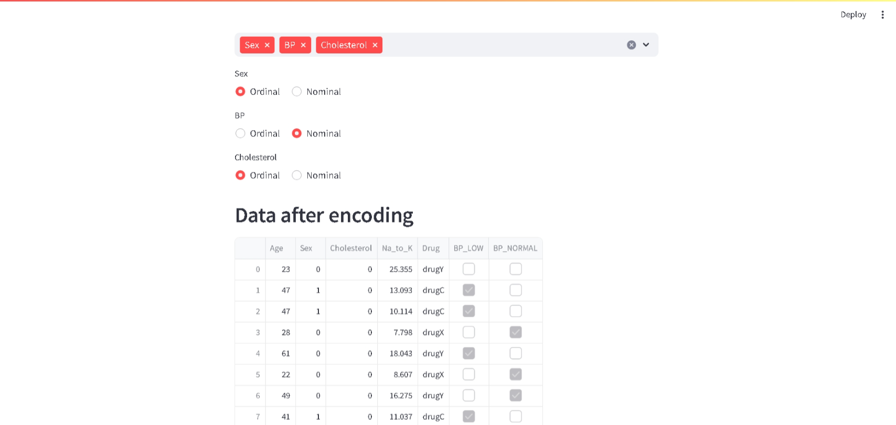
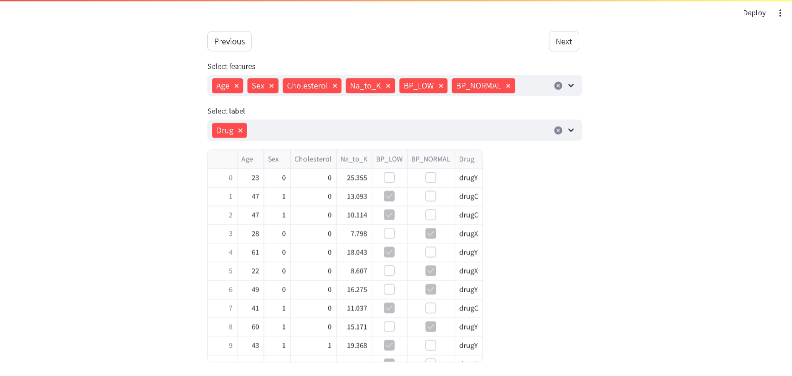
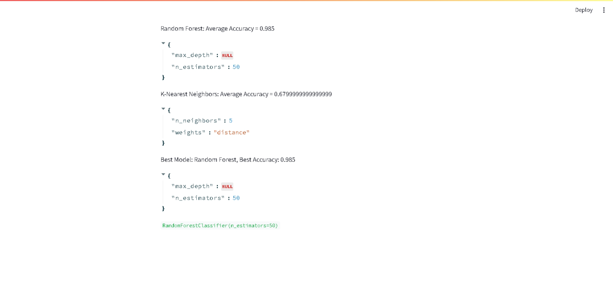

# Capstone Project

In this project, You can know the best ML model for your dataset in 5 steps.

## Step 1: Load your dataset

## Step 2: Understand your dataset and handle missing values

see the most important information

## Step 3: Encode categorical data

Select the columns that you want to encode and the way of encoding (nominal or ordinal)

## Step 4: Select your features and target

Select the features (independent variables) and the target (dependent variable) that you want to use in your model.

## Step 5: Train multiple models and choose the best one

You'll see different models with different parameters, and the best one.

